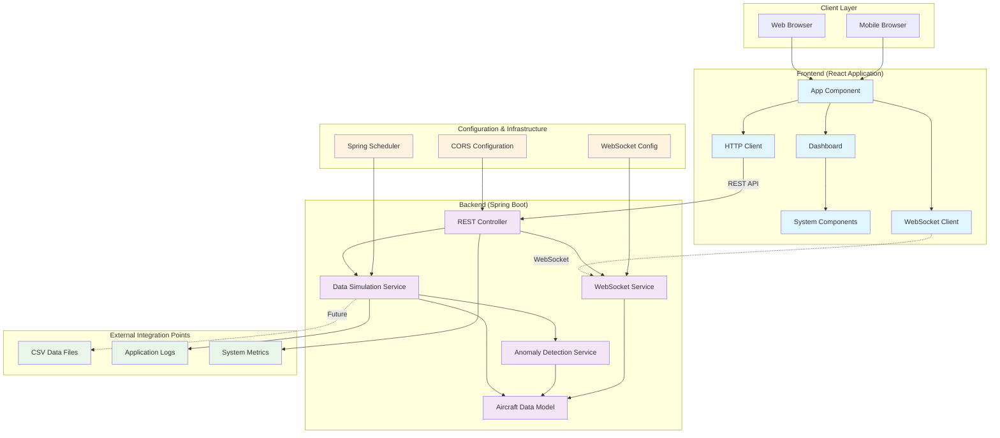
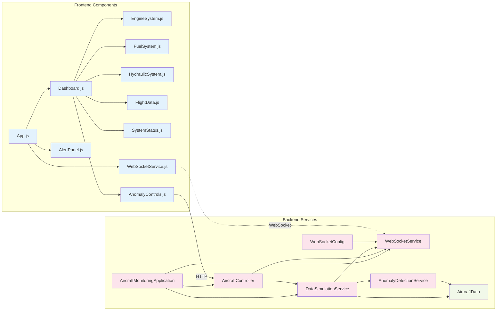
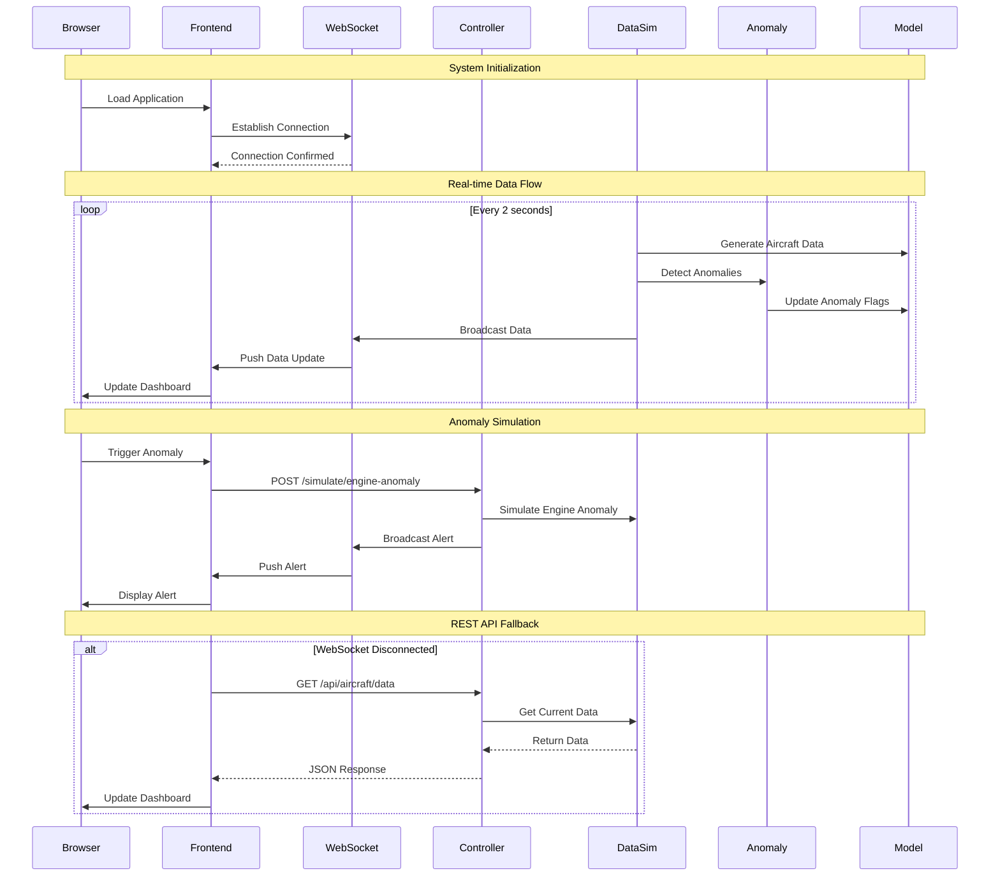
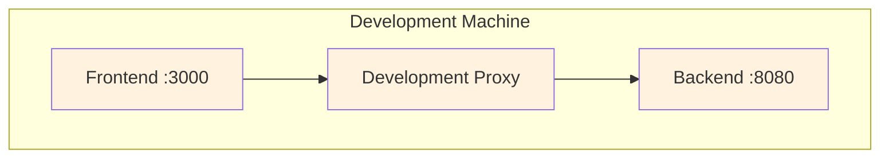
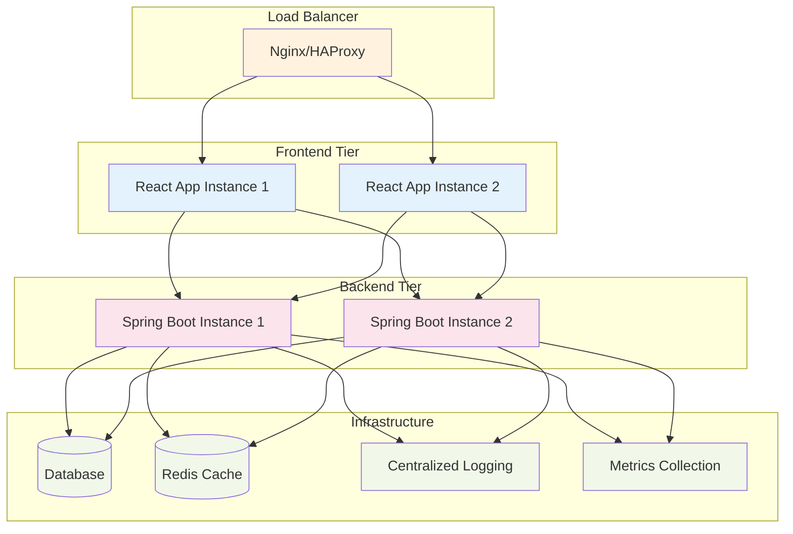

# Aircraft Health Monitoring System - Architecture Documentation

## System Overview

The Aircraft Health Monitoring System is a real-time monitoring application designed to track critical aircraft systems and detect anomalies. The system follows a modern microservices architecture with clear separation between frontend presentation layer and backend business logic.

## High-Level Architecture

## Component Architecture

## Data Flow Architecture

## Technology Stack

### Backend Technologies
- **Framework**: Spring Boot 3.2.0
- **Language**: Java 17
- **Build Tool**: Maven
- **WebSocket**: Spring WebSocket + SockJS
- **JSON Processing**: Jackson
- **CSV Processing**: OpenCSV
- **Documentation**: Lombok
- **Scheduling**: Spring Scheduler
- **Testing**: Spring Boot Test

### Frontend Technologies
- **Framework**: React 18.2.0
- **Language**: JavaScript (ES6+)
- **Build Tool**: Create React App
- **Styling**: Tailwind CSS 3.3.0
- **WebSocket Client**: SockJS Client + WebStomp
- **Charts**: Recharts 2.7.2
- **Icons**: Lucide React
- **HTTP Client**: Fetch API
- **Testing**: React Testing Library

### Development Tools
- **Package Manager**: npm (Frontend), Maven (Backend)
- **CSS Framework**: Tailwind CSS with custom aviation theme
- **Code Quality**: ESLint, PostCSS, Autoprefixer

## System Features

### Core Capabilities
1. **Real-time Data Processing**: Simulates and processes aircraft sensor data every 2 seconds
2. **Anomaly Detection**: Intelligent detection of system anomalies with configurable thresholds
3. **WebSocket Communication**: Low-latency bidirectional communication for real-time updates
4. **REST API**: Comprehensive RESTful endpoints for data access and system control
5. **Fallback Mechanism**: Automatic fallback to REST polling if WebSocket fails
6. **Interactive Dashboard**: Modern, responsive dashboard with aviation-themed UI

### Monitored Aircraft Systems
- **Engine System**: RPM, temperature, oil pressure, oil temperature
- **Fuel System**: Level, consumption, pressure, temperature  
- **Hydraulic System**: Pressure, temperature, fluid level
- **Flight Data**: Altitude, airspeed, ground speed, Mach number, vertical speed
- **Cabin Systems**: Pressure, temperature
- **Electrical Systems**: Battery voltage, generator output

## Security Considerations

### Current Implementation
- **CORS**: Configured to allow all origins (development mode)
- **WebSocket Origins**: Allows all origin patterns with SockJS fallback
- **Data Validation**: Basic input validation on API endpoints
- **Error Handling**: Comprehensive error handling with logging

### Production Recommendations
- Implement proper CORS policy with specific allowed origins
- Add authentication and authorization mechanisms
- Implement rate limiting for API endpoints
- Add input sanitization and validation
- Enable HTTPS/WSS for secure communication
- Implement proper logging and monitoring

## Deployment Architecture

### Development Environment

### Production Architecture Recommendation

## API Endpoints

### REST API Endpoints
| Method | Endpoint | Description |
|--------|----------|-------------|
| GET | `/api/aircraft/data` | Get current aircraft sensor data |
| GET | `/api/aircraft/status` | Get system status and connected clients |
| GET | `/api/aircraft/health` | Get system health information |
| POST | `/api/aircraft/simulate/engine-anomaly` | Trigger engine anomaly simulation |
| POST | `/api/aircraft/simulate/fuel-anomaly` | Trigger fuel anomaly simulation |
| POST | `/api/aircraft/simulate/hydraulic-anomaly` | Trigger hydraulic anomaly simulation |
| POST | `/api/aircraft/alert` | Send custom alert to all clients |

### WebSocket Endpoints
| Endpoint | Protocol | Description |
|----------|----------|-------------|
| `/websocket` | WebSocket/SockJS | Real-time data and alert streaming |

## Performance Characteristics

### Real-time Performance
- **Data Update Frequency**: 2-second intervals
- **WebSocket Latency**: < 50ms typical
- **REST API Response Time**: < 100ms typical
- **Frontend Update Rate**: 30+ FPS smooth animations

### Scalability
- **Concurrent WebSocket Connections**: 100+ (configurable)
- **REST API Throughput**: 1000+ requests/second
- **Memory Usage**: ~50MB (backend), ~25MB (frontend)
- **CPU Usage**: Low (~5% typical)

## Monitoring and Observability

### Built-in Monitoring
- **Spring Boot Actuator**: Health checks, metrics, info endpoints
- **Custom Logging**: Comprehensive application logging with SLF4J
- **Connection Tracking**: Real-time WebSocket client count monitoring
- **System Status**: Overall system health and anomaly tracking

### Metrics Collected
- Connected WebSocket clients count
- Data generation status and frequency
- Anomaly detection rates
- API response times
- System resource utilization

## Future Enhancements

### Near-term Improvements
1. **Database Integration**: Persistent storage for historical data analysis
2. **User Authentication**: Role-based access control for different user types
3. **Advanced Analytics**: Machine learning-based anomaly detection
4. **Mobile Application**: React Native mobile app for field operations
5. **Real Data Integration**: Integration with actual aircraft data feeds

### Long-term Vision
1. **Multi-Aircraft Support**: Monitor multiple aircraft simultaneously
2. **Predictive Maintenance**: AI-powered predictive maintenance recommendations
3. **Cloud Deployment**: Containerized deployment on cloud platforms
4. **IoT Integration**: Direct integration with aircraft IoT sensors
5. **Enterprise Features**: Advanced reporting, compliance, and audit trails

This architecture provides a solid foundation for a production-ready aircraft health monitoring system with excellent scalability, maintainability, and extensibility characteristics.
